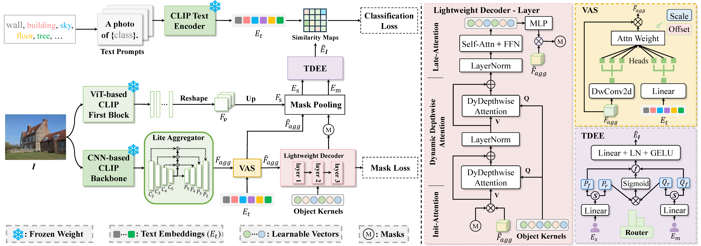

<!-- # EOV-Seg: Efficient Open-Vocabulary Panoptic Segmentation -->

<!-- :fire: News: Our paper [EOV-Seg](https://arxiv.org/abs/2412.08628) is accepted to AAAI 2025! -->

<div align="center">
<h1> EOV-Seg (AAAI 2025) </h1>
<h3>EOV-Seg: Efficient Open-Vocabulary Panoptic Segmentation</h3>

[Hongwei Niu](https://github.com/nhw649)<sup>1</sup>,[Jie Hu](https://github.com/hujiecpp)<sup>2</sup>,[Jianghang Lin](https://github.com/HunterJ-Lin)<sup>1</sup>, Shengchuan Zhang<sup>1</sup>,

<sup>1</sup> Xiamen University, <sup>2</sup> National University of Singapore


[[`Paper`](https://arxiv.org/abs/2412.08628)] [[`Demo`]()] [[`BibTeX`](#citation)]
</div>


## Introduction

Open-vocabulary panoptic segmentation aims to segment and classify everything in diverse scenes across an unbounded vocabulary. Existing methods typically employ two-stage or single-stage framework. The two-stage framework involves cropping the image multiple times using masks generated by a mask generator, followed by feature extraction, while the single-stage framework relies on a heavyweight mask decoder to make up for the lack of spatial position information through self-attention and cross-attention in multiple stacked Transformer blocks. Both methods incur substantial computational overhead, thereby hindering the efficiency of model inference. To fill the gap in efficiency, we propose EOV-Seg, a novel single-stage, shared, efficient, and spatial-aware framework designed for open-vocabulary panoptic segmentation. Specifically, EOV-Seg innovates in two aspects. First, a Vocabulary-Aware Selection (VAS) module is proposed to improve the semantic comprehension of visual aggregated features and alleviate the feature interaction burden on the mask decoder. Second, we introduce a Two-way Dynamic Embedding Experts (TDEE), which efficiently utilizes the spatial awareness capabilities of ViT-based CLIP backbone. To the best of our knowledge, EOV-Seg is the first open-vocabulary panoptic segmentation framework towards efficiency, which runs faster and achieves competitive performance compared with state-of-the-art methods. Specifically, with COCO training only, EOV-Seg achieves 24.2 PQ, 31.6 mIoU, and 12.7 FPS on the ADE20K dataset for panoptic and semantic segmentation tasks and the inference time of EOV-Seg is 4-21 times faster than state-of-the-art methods. Especially, equipped with ResNet-50 backbone, EOV-Seg runs 25 FPS with only 71M parameters on a single RTX 3090 GPU.

<p align="center">

</p>

## :clipboard: Table of content
1. [:hammer_and_wrench: Installation](#installation)
2. [:dart: Model Zoo](#model_zoo)
3. [:bulb: Usage](#usage)
    1. [Prepare Datasets](#prepare)
    2. [Training](#training)
    3. [Inference](#inference)
4. [:books: Citation](#citation)
5. [:scroll: License](#license)
6. [:sparkling_heart: Acknowledgement](#acknowledgement)

## :hammer_and_wrench: Installation <a name="installation"></a>
```bash
conda create --name eov-seg python=3.8 -y
conda activate eov-seg
pip install torch==1.13.0+cu117 torchvision==0.14.0+cu117 torchaudio==0.13.0 --extra-index-url https://download.pytorch.org/whl/cu117

pip install -U opencv-python
git clone https://github.com/facebookresearch/detectron2.git
python -m pip install -e detectron2
pip install git+https://github.com/cocodataset/panopticapi.git
pip install git+https://github.com/mcordts/cityscapesScripts.git

git clone https://github.com/nhw649/EOV-Seg.git
cd EOV-Seg
pip install -r requirements.txt
```

## :dart: Model Zoo <a name="model_zoo"></a>
<table>
<caption>Open-vocabulary panoptic segmentation</caption>
<tbody>
<!-- START TABLE -->
<!-- TABLE HEADER -->
<th valign="bottom">Name</th>
<th valign="bottom">Backbone</th>
<th valign="bottom">PQ</th>
<th valign="bottom">SQ</th>
<th valign="bottom">RQ</th>
<th valign="bottom">AP</th>
<th valign="bottom">mIoU</th>
<th valign="bottom">FPS</th>
<th valign="bottom">Params</th>
<th valign="bottom">Download</th>
<!-- TABLE BODY -->
<!-- ROW: EOV-Seg (S) -->
<tr>
<td align="left">EOV-Seg (S)</a></td>
<td align="center">ResNet50</td>
<td align="center">15.1</td>
<td align="center">57.0</td>
<td align="center">18.9</td>
<td align="center">7.2</td>
<td align="center">21.9</td>
<td align="center">23.8</td>
<td align="center">71M</td>
<td align="center"><a href="https://drive.google.com/file/d/1UgLrRxpi4l30F8zTqhEv7cEW23TCGv3h/view?usp=drive_link">ckpt</a>&nbsp;
</tr>
<!-- ROW: EOV-Seg (M) -->
<tr>
<td align="left">EOV-Seg (M)</a></td>
<td align="center">ResNet50x4</td>
<td align="center">18.7</td>
<td align="center">63.5</td>
<td align="center">23.2</td>
<td align="center">8.5</td>
<td align="center">25.5</td>
<td align="center">18.4</td>
<td align="center">127M</td>
<td align="center"><a href="https://drive.google.com/file/d/1--SYgaWs8_Ry2ouXBJO8FfSWH7D-Pejk/view?usp=drive_link">ckpt</a>&nbsp;
</tr>

<!-- ROW: EOV-Seg (L) -->
<tr>
<td align="left">EOV-Seg (L)</a></td>
<td align="center">ConvNeXt-L</td>
<td align="center">24.5</td>
<td align="center">70.2</td>
<td align="center">30.1</td>
<td align="center">13.7</td>
<td align="center">32.1</td>
<td align="center">11.6</td>
<td align="center">225M</td>
<td align="center"><a href="https://drive.google.com/file/d/1dVfHpzmCOlV6hLfUpd3nHXz62wdB7RY2/view?usp=drive_link">ckpt</a>&nbsp;
</tr>

</tbody>
</table>

<table>
<caption>Open-vocabulary semantic segmentation</caption>
<tbody>
<!-- START TABLE -->
<!-- TABLE HEADER -->
<th valign="bottom">Name</th>
<th valign="bottom">Backbone</th>
<th valign="bottom">A-847</th>
<th valign="bottom">PC-459</th>
<th valign="bottom">A-150</th>
<th valign="bottom">PC-59</th>
<th valign="bottom">PAS-20</th>
<th valign="bottom">FPS</th>
<th valign="bottom">Params</th>
<th valign="bottom">Download</th>
<!-- TABLE BODY -->
<!-- ROW: EOV-Seg (S) -->
<tr>
<td align="left">EOV-Seg (S)</a></td>
<td align="center">ResNet50</td>
<td align="center">6.6</td>
<td align="center">11.5</td>
<td align="center">21.9</td>
<td align="center">46.0</td>
<td align="center">87.2</td>
<td align="center">24.5</td>
<td align="center">71M</td>
<td align="center"><a href="https://drive.google.com/file/d/1UgLrRxpi4l30F8zTqhEv7cEW23TCGv3h/view?usp=drive_link">ckpt</a>&nbsp;
</tr>
<!-- ROW: EOV-Seg (M) -->
<tr>
<td align="left">EOV-Seg (M)</a></td>
<td align="center">ResNet50x4</td>
<td align="center">7.8</td>
<td align="center">12.2</td>
<td align="center">25.5</td>
<td align="center">51.8</td>
<td align="center">91.2</td>
<td align="center">18.9</td>
<td align="center">127M</td>
<td align="center"><a href="https://drive.google.com/file/d/1--SYgaWs8_Ry2ouXBJO8FfSWH7D-Pejk/view?usp=drive_link">ckpt</a>&nbsp;
</tr>

<!-- ROW: EOV-Seg (L) -->
<tr>
<td align="left">EOV-Seg (L)</a></td>
<td align="center">ConvNeXt-L</td>
<td align="center">12.8</td>
<td align="center">16.8</td>
<td align="center">32.1</td>
<td align="center">56.9</td>
<td align="center">94.8</td>
<td align="center">11.8</td>
<td align="center">225M</td>
<td align="center"><a href="https://drive.google.com/file/d/1dVfHpzmCOlV6hLfUpd3nHXz62wdB7RY2/view?usp=drive_link">ckpt</a>&nbsp;
</tr>

</tbody>
</table>

## :bulb: Usage <a name="usage"></a> 
1. Please follow [this](datasets/README.md) to prepare datasets for training. The data should be organized like: <a name="prepare"></a>
```
datasets/
    coco/
        annotations/
        {train, val}2017/
        panoptic_{train, val}2017/
        panoptic_semseg_{train, val}2017/
        stuffthingmaps_detectron2/
    ADEChallengeData2016/
        images/
        annotations/
        annotations_instance/
        annotations_detectron2/
        ade20k_panoptic_{train, val}/
        ade20k_panoptic_{train,val}.json
        ade20k_instance_{train,val}.json
    ADE20K_2021_17_01/
        images/
        images_detectron2/
        annotations_detectron2/
    VOCdevkit/
        VOC2012/
            Annotations/
            JPEGImages/
            ImageSets/
                Segmentation/  
        VOC2010/
            JPEGImages/
            trainval/
            trainval_merged.json
    pascal_voc_d2/
        images/
        annotations_pascal21/
        annotations_pascal20/
    pascal_ctx_d2/
        images/
        annotations_ctx59/
        annotations_ctx459/
```

2. To train a model, use <a name="training"></a>

```bash
# For ConvNeXt-Large variant
python train_net.py --num-gpus 4 --config-file configs/EOV-Seg-convnext-l.yaml
# For ResNet-50x4 variant
python train_net.py --num-gpus 4 --config-file configs/EOV-Seg-R50x4.yaml
# For ResNet-50 variant
python train_net.py --num-gpus 4 --config-file configs/EOV-Seg-R50.yaml
```

3. To evaluate a model's performance, use <a name="inference"></a>

```bash
# For ConvNeXt-Large variant
python train_net.py --config-file configs/EOV-Seg-convnext-l.yaml --eval-only MODEL.WEIGHTS /path/to/checkpoint_file
# For ResNet-50x4 variant
python train_net.py --config-file configs/EOV-Seg-R50x4.yaml --eval-only MODEL.WEIGHTS /path/to/checkpoint_file
# For ResNet-50 variant
python train_net.py --config-file configs/EOV-Seg-R50.yaml --eval-only MODEL.WEIGHTS /path/to/checkpoint_file
```

## :books: Citation <a name="citation"></a>
```bibtex
@article{niu2024eov,
  title={EOV-Seg: Efficient Open-Vocabulary Panoptic Segmentation},
  author={Niu, Hongwei and Hu, Jie and Lin, Jianghang and Zhang, Shengchuan},
  journal={arXiv preprint arXiv:2412.08628},
  year={2024}
}
```

## :scroll: License <a name="license"></a>
EOV-Seg is released under the [Apache 2.0 license](LICENSE). Please refer to [LICENSE](LICENSE) for the careful check, if you are using our code for commercial matters.

## :sparkling_heart: Acknowledgement <a name="acknowledgement"></a> 
-   [YOSO](https://github.com/hujiecpp/YOSO)
-   [FC-CLIP](https://github.com/bytedance/fc-clip)
-   [detectron2](https://github.com/facebookresearch/detectron2)